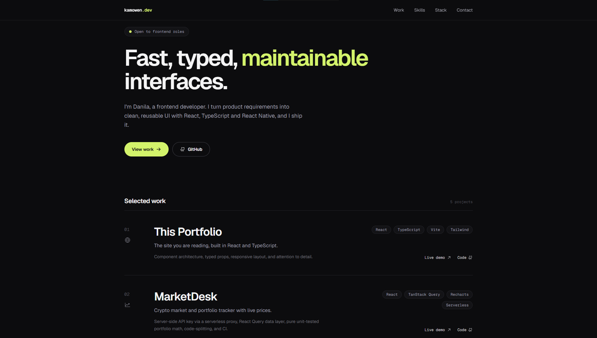

# kamowen.dev · Portfolio

Personal portfolio of a junior frontend developer. Built in React + TypeScript with a dark, typography-first design.

🔗 **Live demo:** [portfolio-pi-one-55befe706c.vercel.app](https://portfolio-pi-one-55befe706c.vercel.app) · 💻 **Code:** this repository



## Features

- Requirement coverage matrix: every skill from a typical junior frontend vacancy mapped to the project that proves it
- Editorial project list with per-project stack and links
- Entrance and scroll-reveal animations that respect `prefers-reduced-motion`
- Fully responsive, keyboard-navigable, visible focus states

## Stack

React · TypeScript · Vite · Tailwind CSS v4 · Motion · Phosphor Icons

## Run locally

```bash
npm install
npm run dev
```

Build for production:

```bash
npm run build
```

## What I learned

Splitting a single-file prototype into typed modules (`types.ts`, `data/`, `components/`) made the page far easier to change, and strict TypeScript caught prop mistakes before the browser did. The hardest part was restraint: one accent color, one type family, and letting spacing do the work.
